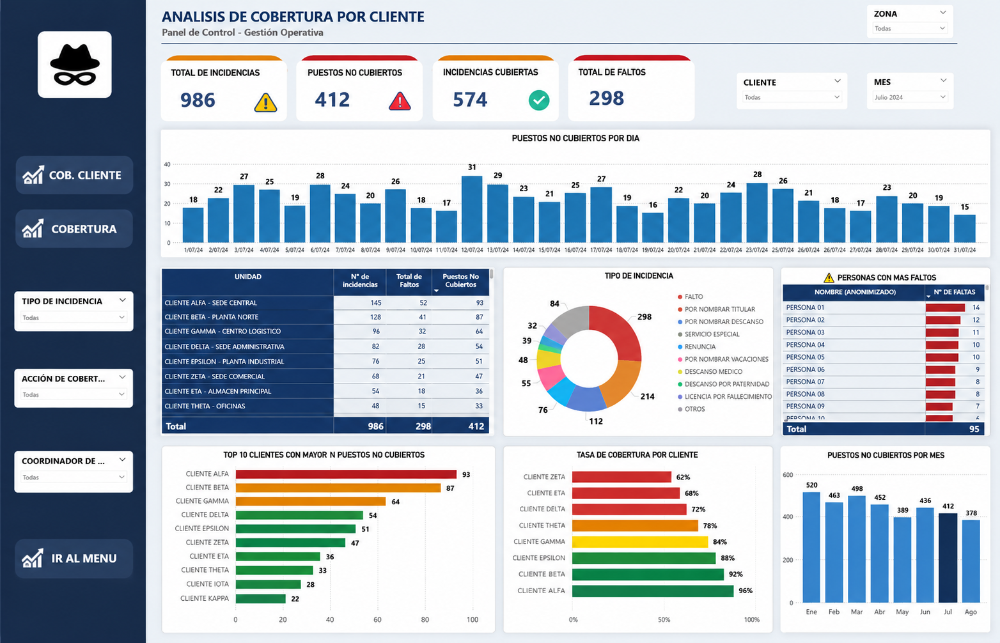

# Operational Coverage Analytics

Dashboard de Business Intelligence desarrollado en **Power BI** para el monitoreo y análisis de la cobertura operativa de servicios en clientes con puestos de trabajo distribuidos (seguridad, operaciones de campo, etc.).



## Business Problem

Las empresas de servicios operativos con personal distribuido en múltiples sedes o clientes suelen tener dificultad para responder, en tiempo real, preguntas como:

- ¿Cuántos puestos no están siendo cubiertos hoy, y en qué cliente?
- ¿Qué porcentaje de las incidencias reportadas ya fueron cubiertas?
- ¿Qué clientes concentran más faltas de personal o incidencias recurrentes?
- ¿Cómo evoluciona la cobertura día a día y mes a mes?

Sin un panel centralizado, esta información suele vivir dispersa en reportes manuales de Excel, lo que retrasa la toma de decisiones y dificulta la identificación de patrones (clientes críticos, personal con más faltas, tipos de incidencia recurrentes).

## Solution

Se desarrolló un dashboard interactivo en Power BI que centraliza la información operativa diaria y permite:

- Monitorear en tiempo real el total de incidencias, puestos no cubiertos, incidencias cubiertas y faltas de personal.
- Analizar la evolución de puestos no cubiertos por día y por mes.
- Comparar el desempeño de cobertura entre clientes (ranking y tasa de cobertura %).
- Clasificar las incidencias por tipo (falta, descanso médico, licencia, renuncia, etc.).
- Identificar al personal con mayor número de faltas (anonimizado en esta versión pública).
- Filtrar dinámicamente por zona, cliente, mes, tipo de incidencia y coordinador de operaciones.

La solución integra información proveniente de fuentes operativas (Excel / Google Sheets), aplica procesos de transformación y limpieza de datos con Power Query, modelado dimensional, creación de indicadores mediante DAX, y visualizaciones interactivas orientadas al análisis gerencial.

## Architecture

```
Excel / Google Sheets (fuentes operativas)
        │
        ▼
   Power Query  →  Limpieza, transformación y estandarización de datos
        │
        ▼
   Modelo de datos (Star Schema)
        │
        ▼
   Medidas DAX  →  KPIs y cálculos de negocio
        │
        ▼
   Power BI  →  Dashboard interactivo
```

> **Evolución futura (no implementada aún):** migración de las fuentes operativas hacia SQL / Microsoft Fabric (Dataflows Gen2 + Lakehouse) con actualización automática vía Power BI Service, para reemplazar la carga manual desde Excel/Google Sheets.

## Data Model

Modelo dimensional tipo **Star Schema**:

- **Fact_Coverage** — tabla de hechos con los registros diarios de incidencias, puestos cubiertos/no cubiertos y faltas.
- **Dim_Client** — catálogo de clientes/sedes.
- **Dim_Date** — calendario para análisis por día, mes y periodo.
- **Dim_Employee** — catálogo de personal (anonimizado en la versión pública).
- **Dim_IncidentType** — catálogo de tipos de incidencia (falta, descanso médico, licencia por fallecimiento, renuncia, etc.).
- **Dim_Coordinator** — catálogo de coordinadores de operaciones responsables por cliente/zona.

Ver el detalle completo del modelo en [`docs/data-model.md`](docs/data-model.md).

## KPIs

| Indicador | Descripción |
|---|---|
| Total de Incidencias | Número total de incidencias reportadas en el periodo |
| Puestos No Cubiertos | Cantidad de puestos operativos sin cobertura de personal |
| Incidencias Cubiertas | Incidencias que ya cuentan con reemplazo/cobertura asignada |
| Total de Faltos | Total de faltas de personal registradas |
| Tasa de Cobertura por Cliente | % de puestos cubiertos sobre el total requerido, por cliente |
| Puestos No Cubiertos por Día/Mes | Tendencia temporal de puestos sin cobertura |
| Top Clientes con Mayor N° de Puestos No Cubiertos | Ranking de clientes según puestos descubiertos |

Ejemplo de medida DAX:

```dax
Coverage Rate =
DIVIDE(
    [Covered Positions],
    [Total Required Positions],
    0
)
```

## Technologies

- Power BI
- Power Query
- DAX
- Excel
- Google Sheets

## Dashboard Preview


El panel incluye filtros dinámicos por **zona, cliente, mes, tipo de incidencia y coordinador de operaciones**, además de:

- Tarjetas KPI (incidencias totales, puestos no cubiertos, incidencias cubiertas, faltas totales)
- Tendencia diaria y mensual de puestos no cubiertos
- Tabla resumen por unidad/cliente
- Distribución de incidencias por tipo (donut chart)
- Ranking de clientes con más puestos no cubiertos
- Tasa de cobertura por cliente (%)
- Ranking de personal con más faltas

## Key Insights

- El panel permite detectar en segundos qué clientes concentran la mayor cantidad de puestos descubiertos, priorizando la gestión operativa donde más impacta.
- La segmentación por tipo de incidencia ayuda a diferenciar entre causas operativas (faltas, renuncias) y causas administrativas (licencias, descansos médicos), orientando distintas estrategias de gestión de personal.
- El ranking de cobertura por cliente facilita conversaciones basadas en datos con los coordinadores de zona sobre el cumplimiento del servicio contratado.

## Confidentiality Notice

> This project is based on a real-world business use case. Company names, employee information and operational data have been anonymized or replaced with synthetic data.

Los nombres de clientes, personal y las cifras mostradas en este repositorio son **ficticios**. No se incluye información interna, operativa sensible, logos oficiales ni datos de identificación de personas reales.
